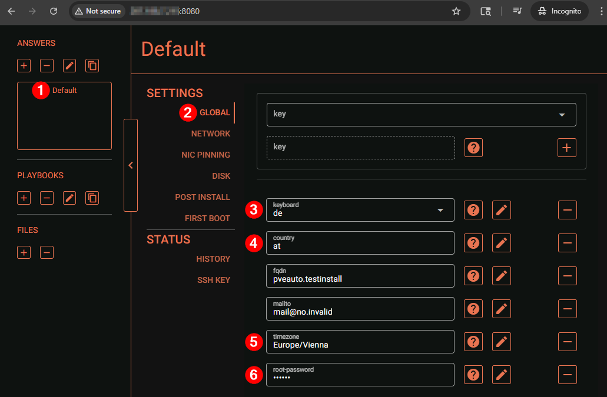
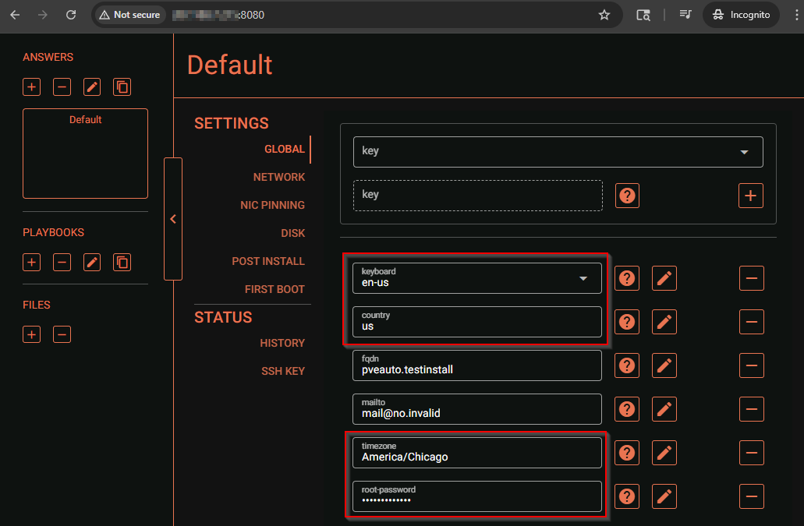
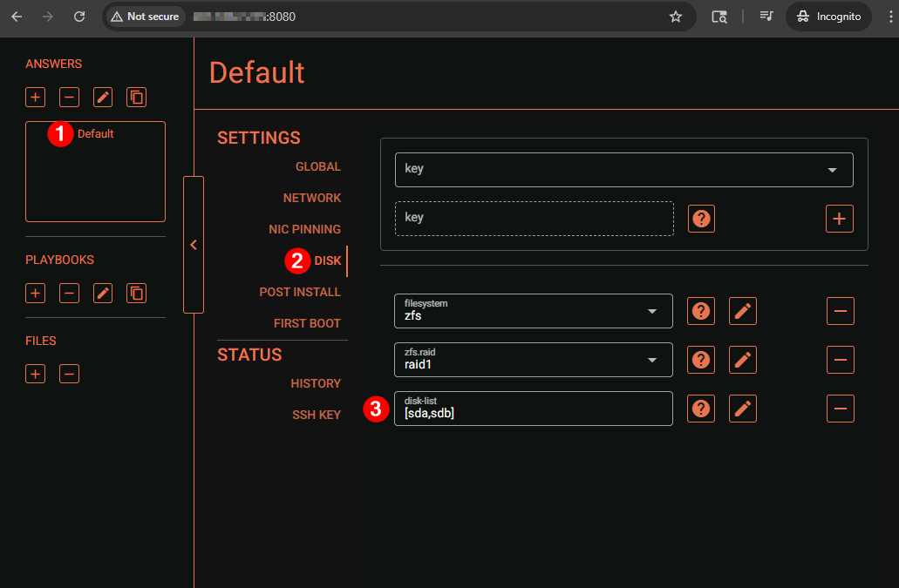
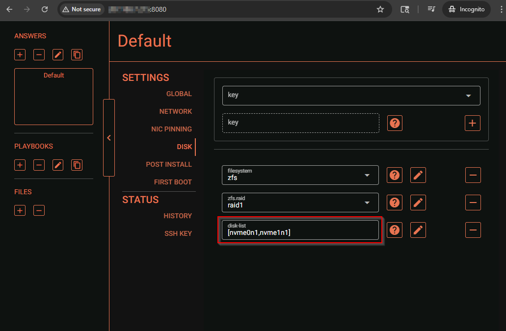

## Usage
This is a basic guide for creating a iPXE install artifact server using a collection of Proxmox official and Community tools. By following this guide, an operator can use a Linux environment to create customized install artifacts for Proxmox VE with auto install configuration injection, and configure the servers necessary to publish these assets on the network. This is intended for use with a bare metal cloud Custom iPXE provisioning process that provides an option to feed a customer defined iPXE scripts to the provisioning process. 

### Sources
https://pve.proxmox.com/wiki/Automated_Installation

https://github.com/morph027/pve-iso-2-pxe

https://github.com/natankeddem/autopve

## Guide

### Add Proxmox Repo and install Proxmox auto-install tools, podman, and pve-iso-2-pxe.sh dependencies
```
sudo wget https://enterprise.proxmox.com/debian/proxmox-release-bookworm.gpg -O /etc/apt/trusted.gpg.d/proxmox-release-bookworm.gpg 
echo "deb http://download.proxmox.com/debian/pve bookworm pve-no-subscription" | sudo tee /etc/apt/sources.list.d/pve-install-repo.list
sudo apt update && sudo apt upgrade -y && sudo apt autoremove -y && sudo apt autoclean
sudo apt install -y cpio file zstd gzip genisoimage podman proxmox-auto-install-assistant
```

### Create pve working directory Download Proxmox ISO and pve-iso-2-pxe script
```
mkdir ~/pve && cd ~/pve
wget https://github.com/morph027/pve-iso-2-pxe/raw/refs/heads/master/pve-iso-2-pxe.sh
wget https://enterprise.proxmox.com/iso/proxmox-ve_9.1-1.iso
```

### Run Proxmox Auto Install assistant tool to request install answer file from http
```
proxmox-auto-install-assistant prepare-iso proxmox-ve_9.1-1.iso --output proxmox-ve_9.1-1-auto-from-http.iso --fetch-from http --url "http://<server_ip>:8080/answer"
```

### Run the pve-iso-2-pxe.sh script against the new ISO file with answers file injected to add contents of ISO to initfs file for booting via PXE
```
bash ./pve-iso-2-pxe.sh proxmox-ve_9.1-1-auto-from-http.iso 
```

### Create install artifact directory structure for nginx and move isos and pxeboot artifacts
```
sudo mkdir -p /opt/pxe/pve/9.1-1/
sudo cp -v proxmox-ve_9.1-1.iso /opt/pxe/pve/9.1-1/proxmox-ve_9.1-1.iso
sudo cp -v proxmox-ve_9.1-1-auto-from-http.iso  /opt/pxe/pve/9.1-1/proxmox-ve_9.1-1-auto-from-http.iso
sudo cp -v ~/pve/pxeboot/* /opt/pxe/pve/9.1-1/
```

### Note: autopve project deployment with Docker
https://github.com/natankeddem/autopve?tab=readme-ov-file#using-docker

### Create working directories from autopve docker container then use podman run to start this container vs docker compose, then open the host firewall to allow this traffic
```
mkdir -p ~/autopve/data ~/autopve/logs
podman run -d --rm --name autopve -p 8080:8080 -v /etc/localtime:/etc/localtime:ro -v ~/autopve/data:/app/data -v ~/autopve/logs:/app/logs -e "PUID=1000" -e "PGID=1000" ghcr.io/natankeddem/autopve:latest
sudo ufw route allow in on enp1s0 out on podman0 to any port 8080 
```

#### Access the autopve UI at http://<server_ip>:8080/ in a browser and set the default and/or host specific configuration for the answer file

Defaults - Global section:



Modifed - Global section:



Defaults - Disk section:



Modifed - Disk section:




### Start http-server docker container with podman run to serve install artifacts and open the host firewall to allow this traffic
```
podman run -d --rm --name http-server -p 5000:5000 -v /opt/pxe:/html:ro,z ghcr.io/patrickdappollonio/docker-http-server:v2
sudo ufw route allow in on enp1s0 out on podman0 to any port 5000 
```

## Deploy/Reinstall bare metal server with the following Custom iPXE script
```
#!ipxe
dhcp
initrd http://<server_ip>:5000/pve/9.1-1/initrd
chain http://<server_ip>:5000/pve/9.1-1/linux26 ro ramdisk_size=16777216 rw quiet splash=silent proxmox-start-auto-installer
```